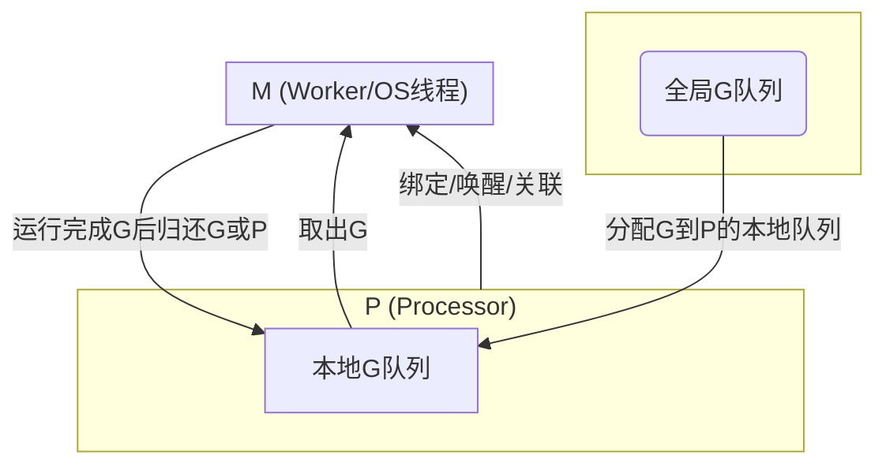

## GMP

> GMP关系简述：
> - **G**：代表 Goroutine，可以存在于P的本地队列或全局队列。
> - **P**：Processor，调度的核心，管理G队列，负责与M绑定，决定G的分发。
> - **M**：实际操作系统线程，负责执行G，由P驱动和调度。
> - 调度流程：M绑定P，从本地或全局队列取G执行，P间可以偷取G负载均衡。
> - **runtime.Gosched** 将当前协程放入全局队列中，然后调度下一个协程。

## 参考资料
- [GO的并发与并行](https://mp.weixin.qq.com/s/ZhfI-E3eTnG4G7-LokseVw)
  - 每个P会维护一个全局运行队列 这个描述有歧义