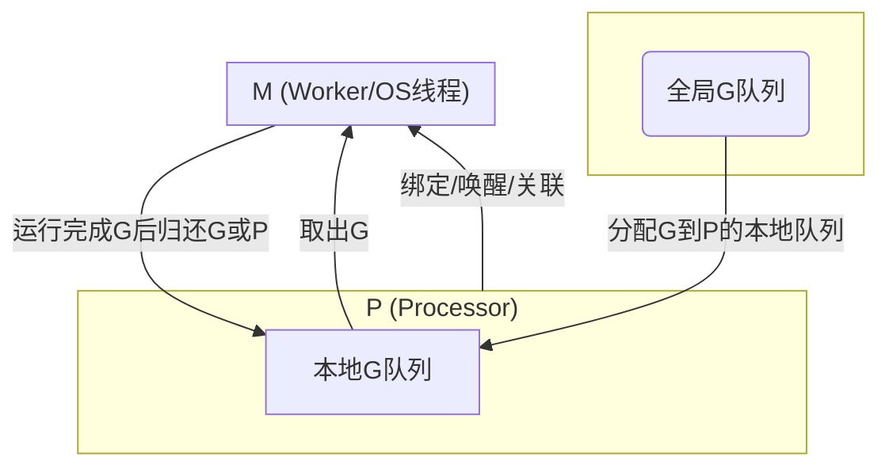

## GMP

> GMP关系简述：
> - **G**：代表 Goroutine，可以存在于P的本地队列或全局队列。
> - **P**：Processor，决定了可以同时使用的核心数，管理G队列，负责与M绑定，决定G的分发。
> - **M**：实际操作系统线程，负责执行G，由P驱动和调度。
> - 调度流程：M绑定P，从本地或全局队列取G执行，P间可以偷取G负载均衡。
> - **runtime.Gosched** 将当前协程放入全局队列中，然后调度下一个协程。

每一个工作线程中都有一个特殊的协程g0，称为调度协程，其主要作用是执行协程调度。
而普通的协程g无差别地用于执行用户代码。

当用户协程g主动让渡、退出或者是被抢占时，m内部就需要重新执行协程调度，
这时需要从用户协程g切换到调度协程g0，g0调度一个普通协程g来执行用户代码，
便从g0又切换回普通协程g。每个工作线程内部都在完成g->g0->g这样的调度循环。

调度策略：
- 查找p本地的运行队列
- 查找全局运行队列 schedt
- 窃取其它p的本地队列

## 参考资料
- [GO的并发与并行](https://mp.weixin.qq.com/s/ZhfI-E3eTnG4G7-LokseVw)
  - 每个P会维护一个全局运行队列 这个描述有歧义
- [golang 协程设计与调度原理](https://mp.weixin.qq.com/s/pgcNXFSWFDqj0I_Yv0cB1A)