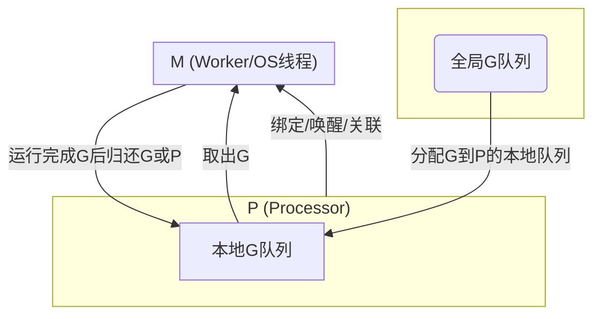
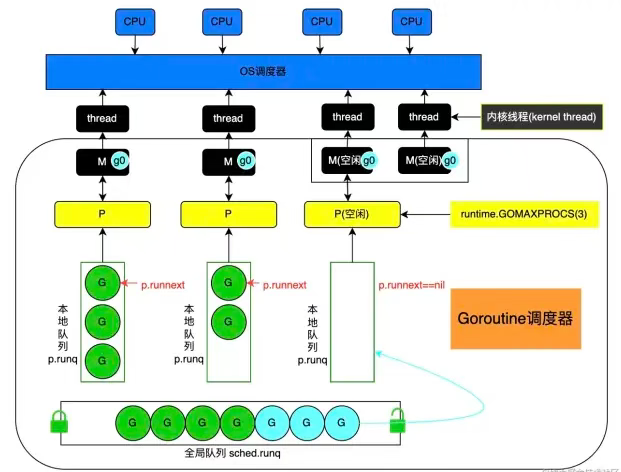

## GMP




> GMP关系简述：
> - **G**：代表 Goroutine，可以存在于P的本地队列或全局队列。
> - **P**：Processor，决定了可以同时使用的核心数，管理G队列，负责与M绑定，决定G的分发。
> - **M**：实际操作系统线程，负责执行G，由P驱动和调度。
> - 调度流程：M绑定P，从本地或全局队列取G执行，P间可以偷取G负载均衡。
> - **runtime.Gosched** 将当前协程放入全局队列中，然后调度下一个协程。


每一个工作线程中都有一个特殊的协程g0，称为调度协程，其主要作用是执行协程调度。
而普通的协程g无差别地用于执行用户代码。

当用户协程g主动让渡、退出或者是被抢占时，m内部就需要重新执行协程调度，
这时需要从用户协程g切换到调度协程g0，g0调度一个普通协程g来执行用户代码，
便从g0又切换回普通协程g。每个工作线程内部都在完成g->g0->g这样的调度循环。

调度策略：
- 查找p本地的运行队列
- 查找全局运行队列 schedt
- 窃取其它p的本地队列

当根据调度策略找不到可运行的协程时，调度器会等在信号量上面，使得M陷入内核等待。

## 场景分析
### 单核死循环
测试代码：
```go
    for{
    }   
```
现象：该协程一直执行
```
Call graph:
    2301 Thread_64371821   DispatchQueue_1: com.apple.main-thread  (serial)
    + 2300 main.main  (in ___go_build_golangatmp) + 28  [0x1001a95dc]
    + ! 2300 main.mainGosched  (in ___go_build_golangatmp) + 0  [0x1001a9600]
```
### 单核调用runtime.Gosched
测试代码：
```aiignore
	runtime.GOMAXPROCS(1)
	for {
		runtime.Gosched()
	}
```
现象和分析：
1. 大部分时间都在执行调度代码。
2. 调度代码会切到g0协程执行，因此基本采样不到for循环所在的堆栈
```aiignore
Call graph:
    2281 Thread_64389799   DispatchQueue_1: com.apple.main-thread  (serial)
    + 416 runtime.findRunnable  (in ___go_build_golangatmp) + 776,592,...  [0x1021666d8,0x102166620,...]
    + 204 runtime.unlock2  (in ___go_build_golangatmp) + 40,188,...  [0x102138cc8,0x102138d5c,...]
    + 202 runtime.casgstatus  (in ___go_build_golangatmp) + 176,124,...  [0x1021626d0,0x10216269c,...]
    + 169 runtime.asmcgocall.abi0  (in ___go_build_golangatmp) + 16,48  [0x102192cb0,0x102192cd0]
    + 140 runtime.mcall  (in ___go_build_golangatmp) + 84  [0x102190a04]
```

### 双核调用runtime.Gosched
测试代码：
```aiignore
	runtime.GOMAXPROCS(2)
	for {
		runtime.Gosched()
	}
```
现象和分析：
1. cpu使用率为100%，无法充分利用双核。原因是，只有一个负载协程。
2. 出现大量的上下文切换。
2. 两个核心争抢一个协程调度，出现大量上下文切换。
3. 由于负载主要是执行调度器代码，这个代码在g0协程执行，因此，采样很难采到目标负载。
```aiignore
Call graph:
    2298 Thread_64406132   DispatchQueue_1: com.apple.main-thread  (serial)
    + 1544 ???  (in <unknown binary>)  [0xd65f03c0]
    + ! 1544 runtime.asmcgocall.abi0  (in ___go_build_golangatmp) + 200  [0x104cead68]
    + !   1544 runtime.pthread_cond_wait_trampoline.abi0  (in ___go_build_golangatmp) + 24  [0x104cec158]
    + !     1544 _pthread_cond_wait  (in libsystem_pthread.dylib) + 984  [0x18e9ee0e0]
    + !       1543 __psynch_cvwait  (in libsystem_kernel.dylib) + 8  [0x18e9af3cc]
    + !       1 DYLD-STUB$$__psynch_cvwait  (in libsystem_pthread.dylib) + 0  [0x18e9f2448]
    + 157 runtime.asmcgocall.abi0  (in ___go_build_golangatmp) + 200  [0x104cead68]
    + ! 134 runtime.usleep_trampoline.abi0  (in ___go_build_golangatmp) + 20  [0x104cebdd4]
    + ! : 134 usleep  (in libsystem_c.dylib) + 68  [0x18e88b60c]
    + ! :   134 nanosleep  (in libsystem_c.dylib) + 220  [0x18e88b6f4]
    + ! :     134 __semwait_signal  (in libsystem_kernel.dylib) + 8  [0x18e9af1c
```

## 参考资料
- [GO的并发与并行](https://mp.weixin.qq.com/s/ZhfI-E3eTnG4G7-LokseVw)
  - 每个P会维护一个全局运行队列 这个描述有歧义
- [golang 协程设计与调度原理](https://mp.weixin.qq.com/s/pgcNXFSWFDqj0I_Yv0cB1A)