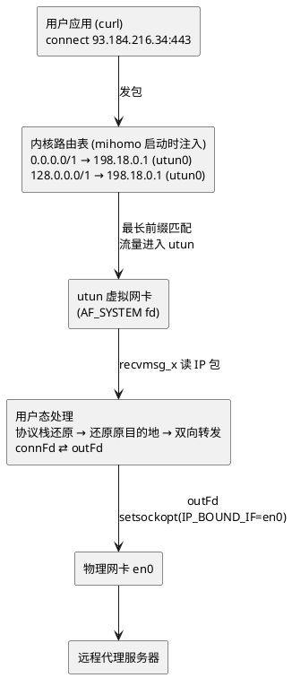
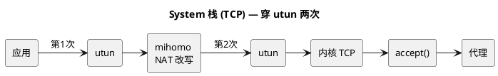
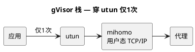
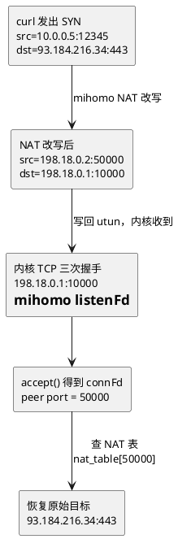
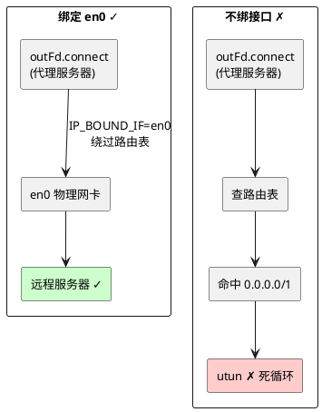

# 简介

分析 mihomo 在 macOS 下透明代理的实现原理。

文档分两部分：

- **第一部分「原理概述」**：图文讲清楚设计思路，不涉及具体系统调用。
- **第二部分「实现细节」**：逐个系统调用展开，附代码。

---

# 第一部分 · 原理概述

## 1. 问题定义

**目标**：在不修改应用、不配置代理环境变量的前提下，把本机所有出站流量（任意协议、任意端口）透明地劫持到用户态程序 mihomo，由它按规则转发到远程代理。

**难点**：

1. 如何把流量从内核"骗"到用户态？ → TUN + 路由劫持
2. 用户态拿到的是原始 IP 包，如何变成可用的 TCP 连接？ → IP 栈处理（三种方案）
3. 代理自己的出站流量怎么不被再次劫持？ → 出站接口绑定

## 2. 整体架构



## 3. 核心机制

### 3.1 流量捕获 = TUN 设备 + 路由劫持

**TUN 设备**：macOS 内核提供的 `utunN` 虚拟网卡。对用户态来说它是一个文件描述符，`read` 读到的是完整 IP 包，`write` 写入的内容内核当作"从这个网卡收到的包"处理。

**路由劫持**：添加 `0.0.0.0/1` 和 `128.0.0.0/1` 两条路由，把网关指向 utun 自身地址（如 `198.18.0.1`）。

为什么不用 `0.0.0.0/0`？

- `0.0.0.0/0` 会覆盖原有默认路由，关闭代理时难以恢复。
- 两条 `/1` 同样覆盖全部 IPv4 地址空间，但保留了原默认路由；基于**最长前缀匹配**，`/1` 优先生效；关闭时只需删除这两条。

地址用 `198.18.0.0/15`（RFC 2544 保留段），不会与真实网络冲突。

### 3.2 协议还原 = 三种 IP 栈

从 utun 读出来的是 L3 原始 IP 包，但代理逻辑需要 L4 连接（TCP stream / UDP datagram）。三种方案：

|          | System 栈           | gVisor 栈          | Mixed 栈            |
| -------- | -------------------- | ------------------- | -------------------- |
| TCP      | 内核 TCP (NAT 借用)  | 用户态 gVisor TCP   | 内核 TCP (NAT)       |
| UDP      | 用户态直接解析       | 用户态 gVisor UDP   | 用户态 gVisor UDP    |
| 穿 utun  | TCP 两次, UDP 一次   | 一次                | TCP 两次, UDP 一次   |
| 复杂度   | NAT 表管理           | 架构简洁            | 两套并存             |
| 性能     | TCP 强, 依赖内核优化 | UDP/短连接好        | 综合最优 (默认推荐)  |

数据路径对比：





### 3.3 System 栈的灵魂 —— NAT 借用内核 TCP

System 栈核心矛盾："从 utun 读出的是 IP 包字节，如何得到一个可 `read/write` 的 TCP socket？"

答案是：**改写 IP 包的目标地址，让内核 TCP 栈以为这个包是发给本机的，完成三次握手后我们 `accept()` 出来用**。



NAT 表维护四元组映射：`NAT端口 → {原src IP/port, 原dst IP/port}`。

代价：**每个包穿越 utun 两次**（读出改写一次，写回被内核处理一次）。gVisor 栈没有这个代价，因为它不借用内核 TCP。

**为什么写回 utun 不会被再次读到？** NAT 改写后的包目的地址是 `198.18.0.1`（utun 自身地址，即本机地址）。往 utun fd 写入数据时，内核将其视为"从 utun 网卡收到的入站包"，走 rx（接收）路径。内核发现目的 IP 是本机地址，命中 local 路由条目，直接走 **local input** 路径递交 TCP 栈，不经过路由选路，因此不会再次被 utun 捕获。只有目的地不是本机的包才会走 forward 路径重新查路由表。

```plantuml
@startuml
skinparam backgroundColor white
skinparam defaultFontSize 13

rectangle "写入 utun fd" as A
rectangle "内核按 rx 处理" as B
diamond "目的 IP\n是本机?" as C
rectangle "local input\n→ TCP 栈\n→ accept()" as D
rectangle "forward 路径\n→ 查路由表\n→ 可能回到 utun" as E

A -right-> B
B -right-> C
C -down-> D : 是 (198.18.0.1)
C -right-> E : 否
@enduml
```

### 3.4 防回环 = 出站接口绑定

mihomo 连接远程代理时创建的 `outFd`，若走默认路由选路，会再次命中 `0.0.0.0/1` 被 utun 抓住 → 死循环。



macOS 的机制是 `setsockopt(IP_BOUND_IF)`（IPv6 是 `IPV6_BOUND_IF`），按**接口索引**绑定，优先级高于路由表。Linux 对应 `SO_BINDTODEVICE`。

出口接口索引（如 en0 的 index）通过两种方式获取：

- **普通模式**：读 `AF_ROUTE` + `sysctl(NET_RT_DUMP)`，找默认网关所在接口。
- **Network Extension 模式**：无权限读路由表，改用 `connect()` 到任意地址 + `getsockname()` 拿内核选的本地 IP，反查接口。

### 3.5 附加能力

| 能力           | 原理                                                                                  |
| ------------ | ----------------------------------------------------------------------------------- |
| **DNS 劫持**   | utun 地址的 next IP（如 `198.18.0.2:53`）自动加入劫持列表，匹配后交给内置 DNS 引擎                          |
| **进程识别**     | `sysctl(net.inet.tcp.pcblist_n)` dump 内核 PCB 表，按源 IP/port 查 PID，再 `proc_info` 取进程路径 |
| **网络变化监控**   | `AF_ROUTE` socket 常驻 `read`，收 `RTM_*` 消息触发回调（刷新接口缓存、重置 DNS）                         |
| **Redir 模式** | 用 PF 防火墙 `rdr` 规则重定向 TCP，mihomo 通过 `DIOCNATLOOK` ioctl 向 `/dev/pf` 查询原始目标           |

## 4. 完整数据流

```plantuml
@startuml
skinparam backgroundColor white
skinparam defaultFontSize 13

rectangle "应用发起连接\ncurl https://example.com" as APP
rectangle "内核路由表\n0.0.0.0/1 | 128.0.0.0/1 → utun" as ROUTE
rectangle "utun 设备\nrecvmsg_x 批量收包\n格式: [4B AF头][IP头][TCP/UDP头][payload]" as TUN

diamond "IP 栈处理" as STACK
rectangle "System: NAT 改写\n→ 写回 utun → 内核 TCP → accept()" as D1
rectangle "gVisor: fdbased endpoint\n→ 用户态 TCP/IP → 直接得到连接" as D2
rectangle "Mixed: TCP 走 System\nUDP 走 gVisor" as D3

rectangle "代理隧道\nDNS 劫持 · 进程识别 · 规则匹配" as TUNNEL
rectangle "outFd\nsetsockopt(IP_BOUND_IF=en0)\n防回环" as OUT
rectangle "物理网卡 en0\n→ 远程代理服务器" as REMOTE

APP -down-> ROUTE
ROUTE -down-> TUN
TUN -down-> STACK

STACK -down-> D1 : System
STACK -down-> D2 : gVisor
STACK -down-> D3 : Mixed

D1 -down-> TUNNEL
D2 -down-> TUNNEL
D3 -down-> TUNNEL

TUNNEL -down-> OUT
OUT -down-> REMOTE
@enduml
```

## 参考资料

- [mihomo Meta 分支](https://github.com/MetaCubeX/mihomo/tree/Meta)
- [sing-tun](https://github.com/metacubex/sing-tun) — 实际 TUN 设备和路由管理库
- [XNU utun 实现](https://github.com/apple-oss-distributions/xnu/blob/main/bsd/net/if_utun.c)
